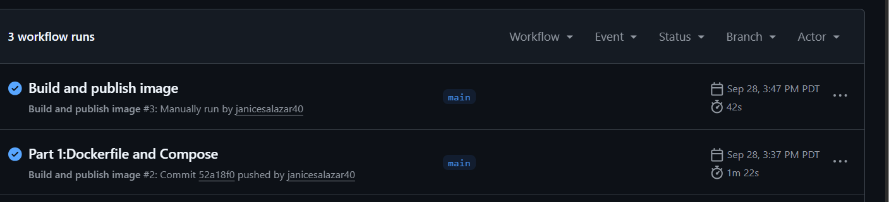
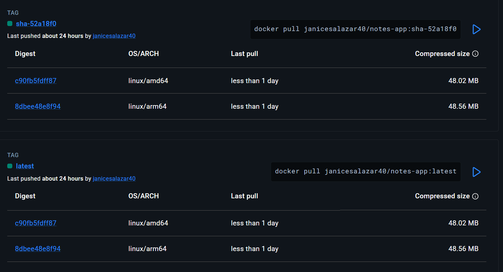

# EVIDENCE.md - Lab 5

## A screenshot of a successful GitHub Actions run


## A screenshot of your Docker Hub tags page showing both architectures


## The output of kubectl get all,pvc from your running cluster
```text 
NAME                      READY   STATUS    RESTARTS   AGE
pod/db-6c5c8947cd-qdc84   1/1     Running   0          29m
pod/web-9b9d787f4-p5nx7   1/1     Running   0          48m
pod/web-9b9d787f4-qlhfh   1/1     Running   0          48m

NAME          TYPE        CLUSTER-IP      EXTERNAL-IP   PORT(S)    AGE
service/db    ClusterIP   10.96.168.137   <none>        5432/TCP   41m
service/web   ClusterIP   10.96.23.72     <none>        80/TCP     35m

NAME                  READY   UP-TO-DATE   AVAILABLE   AGE
deployment.apps/db    1/1     1            1           41m
deployment.apps/web   2/2     2            2           48m

NAME                            DESIRED   CURRENT   READY   AGE
replicaset.apps/db-6c5c8947cd   1         1         1       41m
replicaset.apps/web-9b9d787f4   2         2         2       48m

NAME                            STATUS   VOLUME                                     CAPACITY   ACCESS MODES   STORAGECLASS   VOLUMEATTRIBUTESCLASS   AGE
persistentvolumeclaim/db-data   Bound    pvc-daf4096a-be82-42e6-8ee3-fd286159dbea   1Gi        RWO            standard       <unset>                 41m
```

## The output of the curl commands from Experiments 2 and 3 in Part 3 (persisted notes and multiple served_by values)
    #Experiment 2
    PS C:\Users\janic\notes-app> curl http://localhost:8000/notes


    StatusCode        : 200
    StatusDescription : OK
    Content           : [{"body":"hello from compose","created_at":"2026-09-29T22:22:12.821939+00:00","id":1},{"body":"I should survive a pod deletion","created_at":"2026-09-30T01:00:47.481596+00:00","id":2}]

    RawContent        : HTTP/1.1 200 OK
                        Connection: keep-alive
                        Content-Length: 185
                        Content-Type: application/json
                        Date: Wed, 30 Sep 2026 01:02:08 GMT
                        Server: gunicorn

                        [{"body":"hello from compose","created_at":"2026-...
    Forms             : {}
    Headers           : {[Connection, keep-alive], [Content-Length, 185], [Content-Type, application/json], [Date, Wed, 30
                        Sep 2026 01:02:08 GMT]...}
    Images            : {}
    InputFields       : {}
    Links             : {}
    ParsedHtml        : mshtml.HTMLDocumentClass
    RawContentLength  : 185


    # Experiment 3
    {"message":"Hello from the notes app!","served_by":"web-9b9d787f4-jgdtt","service":"notes-app"}

    {"message":"Hello from the notes app!","served_by":"web-9b9d787f4-qlhfh","service":"notes-app"}

    {"message":"Hello from the notes app!","served_by":"web-9b9d787f4-p5nx7","service":"notes-app"}

    {"message":"Hello from the notes app!","served_by":"web-9b9d787f4-w6r9p","service":"notes-app"}


## The output of kubectl rollout history deployment/web after your rolling update
deployment.apps/web
REVISION  CHANGE-CAUSE
2         <none>
3         <none>
